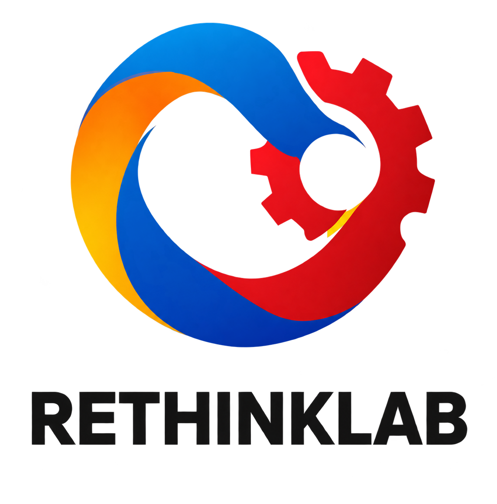

<div align="center">

**English** | [简体中文](README.zh-CN.md)


# OpenLab

### One workspace for your open laboratory.

Connect devices · Manage materials · Build workflows · Trace every execution

<p>
  <a href="https://xuwznln.github.io/OpenLabSite/"></a>
  <a href="https://github.com/Xuwznln/OpenLabSite/actions/workflows/deploy.yml"></a>
  <a href="LICENSE"></a>
  <a href="https://github.com/Xuwznln/OpenLabSite/stargazers"></a>
</p>

**[Open the app](https://xuwznln.github.io/OpenLabSite/)** · **[Local setup](docs/LOCAL_START.md)** · **[API reference](docs/protocol/README.md)** · **[Report an issue](https://github.com/Xuwznln/OpenLabSite/issues)**

<br />

<p align="center"><a href="https://www.sjtu.edu.cn/"></a>&nbsp;&nbsp;&nbsp;<a href="https://thinklab.sjtu.edu.cn/"></a>&nbsp;&nbsp;&nbsp;<a href="https://www.bza.edu.cn/"></a>&nbsp;&nbsp;&nbsp;<a href="https://github.com/deepmodeling"></a></p>

Shanghai Jiao Tong University **ReThinkLab** &nbsp; · &nbsp; **Beijing Zhongguancun Academy** &nbsp; · &nbsp; **DeepModeling**

</div>

---

## Built for the laboratory

OpenLab is a local-first operations interface for [Uni-Lab-OS](https://github.com/deepmodeling/Uni-Lab-OS).
It brings device actions, materials, workflow execution, exception handling, and execution records into one workspace.

**The frontend is deployed independently; the backend owns the data.** By default, the browser connects to
`http://127.0.0.1:8002` on your computer. It does not connect to a public demo server by default or access databases directly.

| | Capability | What you can do |
| --- | --- | --- |
| 🧪 | Device operation | Inspect devices and live properties, fill in action parameters, and submit individual actions |
| 📦 | Material management | Register stock, mount, move, and transfer materials across devices; inspect sites and inventory |
| 🧩 | Workflow authoring | Arrange experimental steps on a canvas, submit runs, and track node progress |
| 🗺️ | Laboratory layout | Explore device and material placement; configure areas, walls, and assemblies |
| 🔔 | Exceptions and intervention | Review status alerts and resolve action errors using options provided by the backend |
| 🔎 | Traceability and diagnostics | Inspect execution history, live logs, registry entries, and runtime state |

> This release is the **general edition**, without organic chemistry, biology, or materials-science theme switching.
> Earlier domain-specific content remains archived in the old repository; see [General edition scope](docs/GENERAL_EDITION.md).
> The application UI and the linked detailed guides are currently primarily in Chinese.

## Quick start

### Use the hosted app

1. Start your Uni-Lab-OS backend following the [local setup guide](docs/LOCAL_START.md).
2. Open **[OpenLabSite](https://xuwznln.github.io/OpenLabSite/)**.
3. Open connection settings (`连接设置`) in the upper-right corner and confirm `http://127.0.0.1:8002`.

If the backend runs on another computer, enter its reachable address manually.
Your browser may request local-network permission. If the HTTPS site cannot reach your local HTTP backend,
run the frontend locally as described below.

### Local development

You need **Node.js 22+**, **pnpm 10.30.3**, and a Uni-Lab-OS backend with its environment already configured.

```bash
git clone https://github.com/Xuwznln/OpenLabSite.git
cd OpenLabSite
pnpm install --frozen-lockfile
pnpm run dev
```

Open the address printed in the terminal (default: `http://localhost:5180`).
**5180 serves the frontend; 8002 is the backend management API.** Do not enter the HostLink communication port.

For a HostLink backend, run the following from your configured **Uni-Lab-OS source directory**, not the frontend directory:

```bash
python -m unilabos.app.main --backend hostlink --port 8002 --config unilabos/config/example_config.py --disable_browser
```

The default startup runs the backend scheduler and Host device runtime in separate processes.
This example starts without a device graph; install and start devices through the frontend, or supply your graph at startup.
See the **[local setup guide](docs/LOCAL_START.md)** for device loading, deployment details, and troubleshooting.

<details>
<summary><strong>Custom addresses and proxy settings</strong></summary>

No `.env` file is required by default. Configure these options only when changing your deployment:

| Setting | Purpose |
| --- | --- |
| `VITE_DEFAULT_EDGE_URL` | Default backend address on the first visit |
| `OPENLAB_EDGE_PROXY_TARGET` | Backend target for Vite's same-origin `/api` development proxy |
| `VITE_OPENLAB_DEVICE_INDEX_URL` | Custom driver-package index |
| `VITE_OPENLAB_SITE_INDEX_URL` | Custom frontend-site directory |

Connection settings are stored in your browser. Old public demo addresses are migrated to the default once;
other custom addresses are preserved.
For production deployments, restrict CORS and network access. Never expose an unprotected management port to the internet.
See [.env.example](.env.example) for configuration details.

</details>

## Development and architecture

**Vue 3 · TypeScript · Pinia · Naive UI · Vue Flow · Vite**

The frontend accesses the backend through the standalone `@openlab/protocol` client.
HTTP retrieves business data, while SSE notifications trigger fresh reads.
Scheduling, authoritative material state, and execution state remain the backend's responsibility.

| Directory | Responsibility |
| --- | --- |
| `src/views/` | Device, material, workflow, and monitoring pages |
| `src/components/` | Shared interaction components |
| `src/stores/` | Connection and page state |
| `src/features/` | Pure logic for forms, layouts, workflows, and related features |
| `packages/protocol/` | Typed client, contract validation, and protocol tests |
| `docs/protocol/` | API conventions and domain specifications |

Further reading: [TypeScript SDK](packages/protocol/README.md) · [Architecture](docs/ARCHITECTURE.md) · [Protocol overview](docs/protocol/README.md) · [AI customization guide](docs/VIBE_GUIDE.md)

### Validation

```bash
pnpm run protocol:check
pnpm run protocol:test
pnpm run app:test
pnpm run app:build
```

Run these commands in order: the protocol check regenerates the protocol package's build output
and must not run concurrently with the other tests.
Protocol changes also require a live smoke test against a real backend, as described in the
[protocol documentation](docs/protocol/README.md). Tests using `--write` modify data; use an isolated test environment.

### Deployment

GitHub Actions validates and builds `main`, then publishes directly to **this repository's GitHub Pages**.
Pull requests run validation only. No cross-repository deployment key is needed, and generated `dist/` files are not committed.

## Contributing

Issues, documentation improvements, interaction refinements, and code contributions are welcome.

- Read [AGENTS.md](AGENTS.md) first and respect the existing backend protocol boundaries.
- If the UI needs an API capability that does not exist, raise the requirement rather than inventing a protocol.
- Pass all four checks above before submitting. Never commit credentials, databases, or laboratory data.
- Thank you to every [contributor](https://github.com/Xuwznln/OpenLabSite/graphs/contributors).

Project code is licensed under [Apache-2.0](LICENSE). Institution logos remain the property of their respective owners;
see [logo sources](public/brands/README.md). The backend and device drivers have their own licenses.

## Star History

If OpenLab helps your work, consider giving it a **Star** and sharing how you use it in your laboratory.

<div align="center">
  <a href="https://www.star-history.com/#Xuwznln/OpenLabSite&Date">
    <picture>
      <source media="(prefers-color-scheme: dark)" srcset="https://api.star-history.com/svg?repos=Xuwznln/OpenLabSite&amp;type=Date&amp;theme=dark" />
      <source media="(prefers-color-scheme: light)" srcset="https://api.star-history.com/svg?repos=Xuwznln/OpenLabSite&amp;type=Date" />
      
    </picture>
  </a>
  <p><sub>Chart provided by Star History. It may be empty when there are no star records. If the image does not load, click through to view it.</sub></p>
</div>
